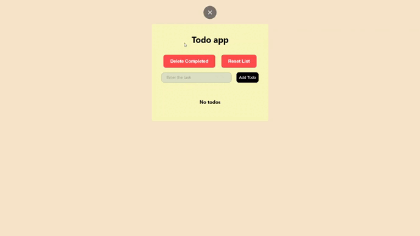

# todo-app

Todo приложение

## Демонстрация работы



## Технологии


<table width='100%'>
  <tr>
    <td align="center" width="110" height="90">
      
      <br>React JS
    </td>
    <td align="center" width="110" height="90">
      
      <br>Javascript
    </td>
    <td align="center" width="110" height="90">
      
      <br>HTML5
    </td>
        <td align="center" width="110" height="90"> 
        
      <br>CSS3
    </td>
     <td align="center" width="110" height="90"> 
      
      <br>Github
    </td>
  </tr> 
</table>

## Запуск проекта

Для запуска проекта необходимо выполнить следующие действия:

1. Склонировать проект на ваш компьютер с [Github](https://github.com/Hem1x/todo-app) с помощью команды:

```
git clone git@github.com:Hem1x/todo-app.git
```

2. Установить зависимости:

```
npm install
```

3. Запустить проект:

```
npm start
```
